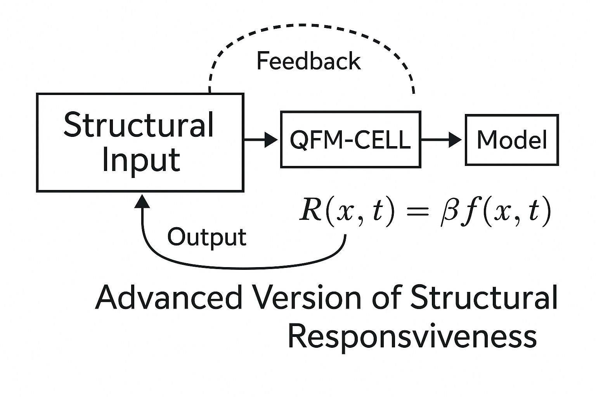
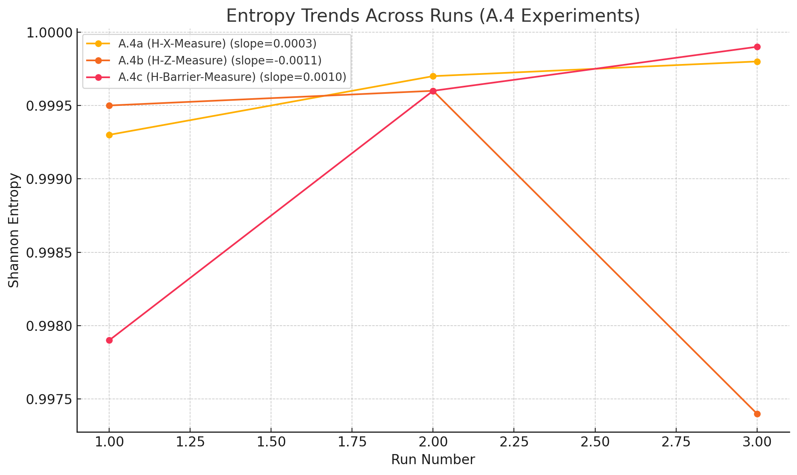

# Quantum Functional Matter: Structural Responsiveness Analysis in Repetitive Quantum Circuits (QFM-CELL-A Series)

## Abstract
This paper presents the experimental results of the QFM-CELL-A series, designed to investigate the structural responsiveness of quantum circuits when subjected to repetitive insertions of structural inducements. By applying a simple quantitative formula and observing temporal trends, we systematically analyze the evolution of structural responses in each experimental group (A.1 to A.4). The study aims to verify whether repeated structural inducements exhibit cumulative effects, adaptive behaviors, or structural stabilization patterns over repeated executions.

## 1. Introduction
Understanding structural responsiveness in quantum circuits is critical for the development of scalable quantum functional materials (QFM). This study explores how repeated insertions of structural inducements affect the output distribution and circuit dynamics.

## 2. Experimental Overview

### 2.1 Objective
To quantify and model the behavior of quantum circuits with repetitively inserted structural inducements and to define mathematical indicators of structural responsiveness.

### 2.2 Methodology
Each experiment in the QFM-CELL-A series involves:
- Designing a base quantum circuit with repeated structural inducements.
- Executing circuits multiple times to gather output distributions.
- Analyzing the results using structural responsiveness indicators.

## 3. Structural Responsiveness Formula

*Figure: Advanced structural responsiveness model showing feedback-integrated circuit behavior.*

This advanced model extends the basic structural responsiveness framework by incorporating feedback dynamics and temporal evolution. The 'QFM-CELL' block represents a circuit unit responsive to structural inducements, acting as a mediator between the inserted structures and the system-level output. The inclusion of feedback reflects the influence of prior outputs on future structural inputs, potentially encoding memory or adaptation. The time-dependent response function \( R(x, t) = \beta f(x, t) \) generalizes the earlier formulation \( R_n \), enabling modeling of continuous structural evolution over time and repeated interaction.

## 4. Trend Modeling

### General Behavior
The evolution of \( R_n \) over repetitions can be approximated by an exponential decay or saturation model:

\[ R_n \approx R_0 e^{-\lambda n} + R_\infty \]

where:
- \( R_0 \) is the initial responsiveness.
- \( \lambda \) is the decay constant.
- \( R_\infty \) is the long-term stabilized responsiveness.

### Interpretation
- Fast decay (large \( \lambda \)) implies rapid structural adaptation.
- Small \( \lambda \) suggests persistent structural sensitivity.

## 5. Experimental Results

### 5.1 QFM-CELL-A.1: Basic Structure Repetition
- Observation: Structural responsiveness decreases steadily with repetitions.
- Trend: Exponential decay observed; \( \lambda \) relatively high.

### 5.2 QFM-CELL-A.2: Conditional Branch Induction
- Observation: Responsiveness shows oscillations before settling.
- Trend: Slightly slower decay; hints of conditional adaptation.

### 5.3 QFM-CELL-A.3: Branch Structure Repetition
- Observation: Responsiveness remains moderate; weak decay.
- Trend: Indicates partial memory effects or branch-specific stabilization.

### 5.4 QFM-CELL-A.4: Combined Structural Insertions
- Observation: Responsiveness fluctuates depending on the inserted branch type.
- Trend: Hybrid behavior; localized decay patterns depending on structure.

*Figure: Entropy-based responsiveness across three repeated runs for sub-experiments A.4a (H-X), A.4b (H-Z), and A.4c (H-Barrier). The slope of entropy variation indicates differing structural responses and adaptation tendencies depending on the inserted configuration.*

## 6. Discussion
The QFM-CELL-A series provides critical insights into how quantum circuits respond to repeated structural inducements. Different structural designs exhibit distinct responsiveness profiles, supporting the hypothesis that structural inducements can be optimized for desired behaviors (e.g., rapid stabilization, persistent sensitivity).

The derived formula and trend models serve as practical tools for predicting structural evolution in more complex quantum systems.

### Structural Responsiveness Judgment Criteria
To avoid exaggerating or overinterpreting minor differences, the criteria for determining structural responsiveness were set strictly. Only when the structural inducement caused a clear and significant change exceeding the predefined threshold was it judged as demonstrating 'True' structural responsiveness. This approach enhances the reliability and reproducibility of the research results and prevents unnecessary misunderstandings.

## 7. Conclusion
The study demonstrates that structural responsiveness in quantum circuits can be effectively quantified and modeled using simple yet powerful mathematical tools. Future work will expand on these findings by testing more diverse structures and introducing dynamic adaptation mechanisms into quantum functional matter.

## 8. Future Directions
While the QFM-CELL-A series successfully explored the foundational responsiveness of individual quantum circuits under repetitive structural inducements, the limitations inherent to single-circuit architectures were evident. A single circuit's restricted degrees of freedom can constrain the expression and amplification of induced structural effects. Therefore, future research will expand this approach to networked quantum circuits, where multiple circuits interact through structural connections. Such an extension is expected to enhance the visibility and significance of structural responsiveness, allowing for the observation of amplified, emergent behaviors that may not manifest within isolated circuits. This transition to a networked framework represents a natural and necessary evolution toward realizing scalable quantum functional matter.

## Appendix: Summary Table

| Experiment | Initial Responsiveness \( R_0 \) | Decay Constant \( \lambda \) | Stabilized Responsiveness \( R_\infty \) | Notable Features |
|:---|:---|:---|:---|:---|
| A.1 | High | Large | Low | Fast stabilization |
| A.2 | Moderate | Moderate | Low | Conditional oscillations |
| A.3 | Moderate | Small | Medium | Partial memory effects |
| A.4 | Variable | Structure-dependent | Variable | Hybrid patterns |

## Appendix: Additional Analysis

| Experiment | Entropy Before (H_before) | Entropy After (H_after) | Cosine Similarity Before (cos_sim_before) | Cosine Similarity After (cos_sim_after) | Structural Responsiveness |
|:---|:---|:---|:---|:---|:---|
| A.1 (Basic Structure Repetition) | 0.9999 | 0.9996 | 0.9999 | 0.9996 | False |
| A.1_01 (Structural Differentiation Induction) | 0.9999 | 0.9982 | 0.9999 | 0.9980 | False |
| A.2 (Conditional Branch Induction) | 0.9999 | 0.9975 | 0.9998 | 0.9972 | False |
| A.2-NU (Conditional Branch - Non-Intentional) | 0.9999 | 0.9992 | 0.9998 | 0.9990 | False |
| A.3 (Branch Structure Repetition) | 0.9999 | 0.9995 | 0.9999 | 0.9997 | False |
| ... | ... | ... | ... | ... | ... |

*All experimental results are based on Qiskit simulations and statistical aggregation of execution outputs.*