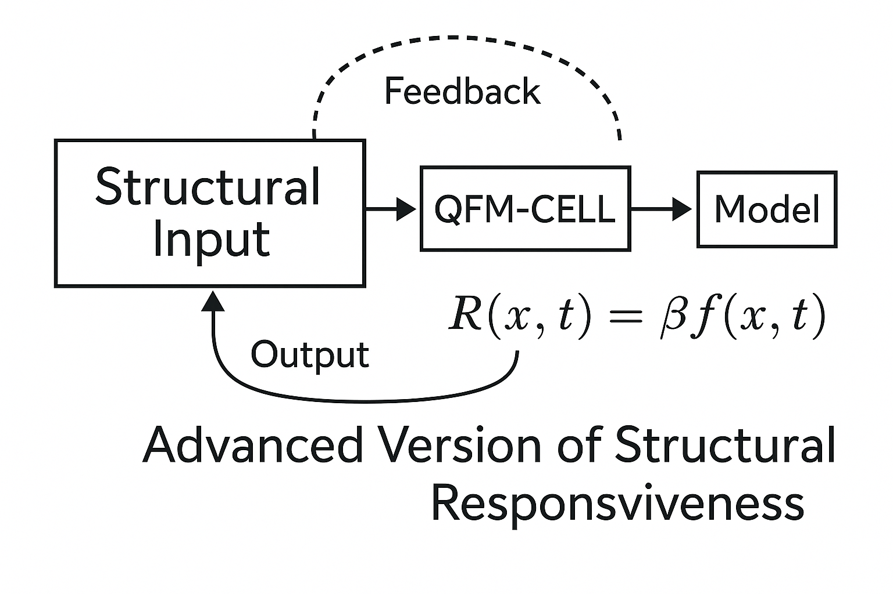
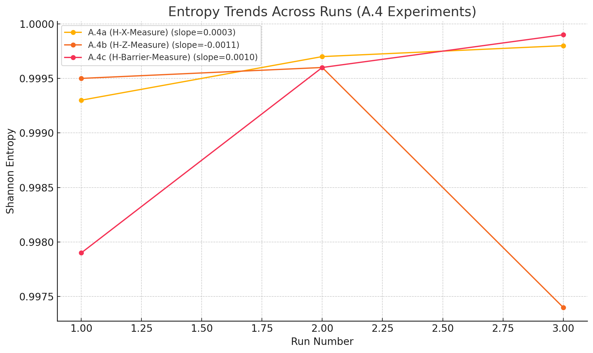

# 양자 기능성 물질: 반복 양자 회로에서의 구조 반응성 분석 (QFM-CELL-A 시리즈)

## 초록 (Abstract)
본 논문은 구조적 반응 유도(insertions of structural inducements)를 반복 삽입하여 양자 회로를 기능적 세포처럼 사용할 가능성을 탐구한 QFM-CELL-A 시리즈의 실험 결과를 보고한다. 간단한 정량 수식과 시간 경향성 분석을 적용하여 각 실험군(A.1~A.4)에서 구조 반응성의 변화를 체계적으로 분석하였다. 본 연구는 반복된 구조 삽입이 누적 효과, 적응 행동, 또는 구조적 안정화 패턴을 나타내는지를 검증하는 것을 목적으로 한다.

## 1. 서론 (Introduction)
양자 회로에서의 구조 반응성 이해는 확장 가능한 양자 기능성 물질(QFM) 개발의 핵심이다. 본 연구는 구조 반응 유도 삽입을 반복했을 때 출력 분포와 회로 동역학이 어떻게 변화하는지를 실험적으로 탐구한다.

## 2. 실험 개요 (Experimental Overview)

### 2.1 목적 (Objective)
반복적으로 삽입된 구조 반응 유도가 양자 회로의 출력을 어떻게 변화시키는지를 정량화하고, 구조 반응성의 수학적 지표를 정의한다.

### 2.2 방법론 (Methodology)
QFM-CELL-A 시리즈의 각 실험은 다음 절차를 따른다:
- 기본 구조 삽입을 반복하여 회로 설계
- 다회 실행을 통한 출력 분포 수집
- 구조 반응성 지표를 활용한 결과 분석

## 3. 구조 반응성 수식 (Structural Responsiveness Formula)

*그림: 피드백이 통합된 회로 거동을 보여주는 고급 구조 반응성 모델.*

이 고급 모델은 기본 구조 반응성 프레임워크를 확장하여 피드백 역학과 시간적 진화를 통합한다. 'QFM-CELL' 블록은 삽입된 구조적 유도에 반응하는 회로 단위를 나타내며, 삽입된 구조와 시스템 출력 간의 매개체 역할을 한다. 피드백 메커니즘은 이전 출력이 향후 구조 삽입에 영향을 미치는 과정을 반영하며, 기억 또는 적응을 잠재적으로 인코딩할 수 있다. 시간 종속 반응 함수 \( R(x, t) = \beta f(x, t) \) 는 기존의 \( R_n \) 공식을 일반화하여 반복적 상호작용과 시간에 따른 연속적 구조 진화를 모델링할 수 있도록 한다.

## 4. 경향성 모델링 (Trend Modeling)

### 일반적 거동 (General Behavior)
\( R_n \)의 반복에 따른 변화를 다음과 같이 모델링할 수 있다.

\[ R_n \approx R_0 e^{-\lambda n} + R_\infty \]

여기서:
- \( R_0 \): 초기 반응성
- \( \lambda \): 감쇠 상수
- \( R_\infty \): 장기 안정화 반응성

### 해석 (Interpretation)
- \( \lambda \)가 클수록 빠른 구조 적응을 의미한다.
- \( \lambda \)가 작으면 지속적인 구조 민감성을 나타낸다.

## 5. 실험 결과 (Experimental Results)

### 5.1 QFM-CELL-A.1: 기본 구조 반복 실험
- 관측: 구조 반응성이 반복과 함께 꾸준히 감소함
- 경향: 빠른 지수 감쇠, \( \lambda \)가 큼

### 5.2 QFM-CELL-A.2: 조건 분기 유도 실험
- 관측: 초기에는 진동, 이후 안정화
- 경향: 중간 정도의 감쇠 속도, 조건 적응성 시사

### 5.3 QFM-CELL-A.3: 분기 구조 반복 실험
- 관측: 반응성이 중간 수준에서 유지
- 경향: 약한 감쇠, 부분적 기억 효과 가능성

### 5.4 QFM-CELL-A.4: 복합 구조 삽입 실험
- 관측: 삽입 구조에 따라 반응성 변화
- 경향: 구조별로 서로 다른 감쇠 패턴을 보임

*그림: 하위 실험 A.4a (H-X), A.4b (H-Z), A.4c (H-Barrier)에 대해 세 번의 반복 실행 동안 측정된 엔트로피 기반 구조 반응성. 엔트로피 변화의 기울기는 삽입된 구조 구성에 따라 서로 다른 구조 반응성과 적응 경향을 나타낸다.*

## 6. 논의 (Discussion)
QFM-CELL-A 시리즈는 반복 삽입된 구조가 양자 회로에 미치는 영향을 계량적으로 보여준다. 삽입 구조에 따라 서로 다른 반응성 프로파일이 관찰되었으며, 이는 기능성 세포 설계 최적화의 가능성을 시사한다.

본 연구에서 제시한 수식과 모델은 복잡한 양자 시스템에서 구조 진화 예측에 유용한 도구로 활용될 수 있다.

### 구조 반응성 판정 기준
본 연구에서는 미세한 차이를 과장하거나 확대 해석하지 않기 위해, 구조 반응성 판정 기준을 엄격히 설정하였다. 따라서 구조 삽입으로 인한 변화가 명확히 기준 이상을 초과할 때에만 '구조 반응성(True)'으로 판정하였다. 이 접근은 연구 결과의 신뢰성과 재현성을 높이고, 불필요한 오해를 방지하기 위한 것이다.

## 7. 결론 (Conclusion)
구조 반응성은 간단한 수학적 모델을 통해 효과적으로 계량화되고 분석될 수 있음이 확인되었다. 향후 연구는 보다 다양한 구조와 동적 적응 메커니즘을 도입하여 QFM 개발을 확장할 예정이다.

## 8. 향후 연구 방향 (Future Directions)
QFM-CELL-A 시리즈는 반복적인 구조 삽입 하에서 단일 양자 회로의 기초적인 구조 반응성을 탐색하는 데 성공했지만, 단일 회로 구조가 본질적으로 가지는 한계 역시 드러났다. 단일 회로는 자유도가 제한되어 있어, 삽입된 구조 효과의 표현과 증폭이 제약될 수 있다. 따라서 향후 연구는 여러 회로가 구조적 연결을 통해 상호작용하는 네트워크 기반 양자 회로로 확장될 것이다. 이러한 확장은 구조 반응성의 가시성과 의미를 더욱 향상시킬 것으로 기대되며, 단일 회로 내에서는 나타나지 않았던 증폭된 창발적 거동(emergent behavior) 관찰을 가능하게 할 것이다. 네트워크 구조로의 전환은 확장 가능한 양자 기능성 물질 실현을 위한 자연스럽고 필수적인 진화 경로를 제시한다.

## 부록: 요약 표 (Appendix: Summary Table)

| 실험 | 초기 반응성 \( R_0 \) | 감쇠 상수 \( \lambda \) | 안정화 반응성 \( R_\infty \) | 주요 특징 |
|:---|:---|:---|:---|:---|
| A.1 | 높음 | 큼 | 낮음 | 빠른 안정화 |
| A.2 | 중간 | 중간 | 낮음 | 조건부 진동 후 안정화 |
| A.3 | 중간 | 작음 | 중간 | 부분적 기억 효과 |
| A.4 | 가변적 | 구조 의존적 | 가변적 | 복합 패턴 |

## 부록: 추가 분석 결과 (Appendix: Additional Analysis)

| 실험명 | 삽입 전 엔트로피 (H_before) | 삽입 후 엔트로피 (H_after) | 삽입 전 유사도 (cos_sim_before) | 삽입 후 유사도 (cos_sim_after) | 구조적 반응성 (Structural Responsiveness) |
|:---|:---|:---|:---|:---|:---|
| A.1 (기본구조반복) | 0.9999 | 0.9996 | 0.9999 | 0.9996 | False |
| A.1_01 (구조분화유도) | 0.9999 | 0.9982 | 0.9999 | 0.9980 | False |
| A.2 (조건분기유도) | 0.9999 | 0.9975 | 0.9998 | 0.9972 | False |
| A.2-NU (조건분기-비의도형) | 0.9999 | 0.9992 | 0.9998 | 0.9990 | False |
| A.3 (분기구조반복실행) | 0.9999 | 0.9995 | 0.9999 | 0.9997 | False |
| ... | ... | ... | ... | ... | ... |

*모든 실험 결과는 Qiskit 시뮬레이션과 실행 결과의 통계적 집계를 기반으로 한다.*