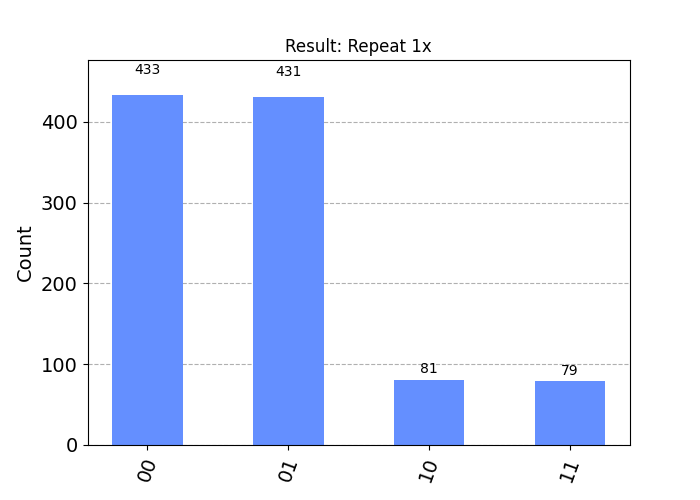
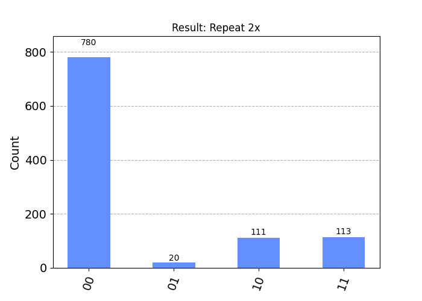
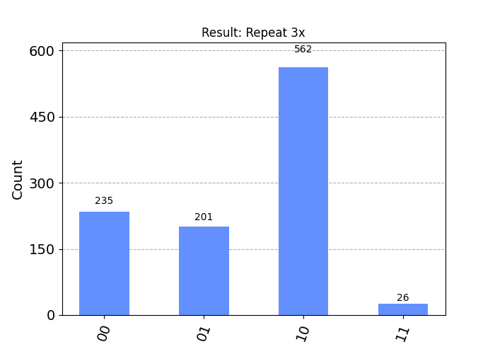
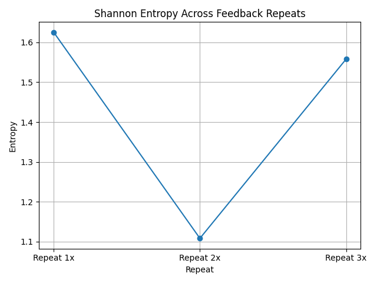

# QFM-CELL-A.1 실험 종합 보고서 | Comprehensive Report: Structural Responsiveness in Repetitive Functional Cell Circuits

## 1. 실험 개요 및 목적 | Overview and Objective

하나의 기본 구조(게이트 패턴)를 동일하게 반복 삽입할 경우, 출력 상태에서 기능 또는 확률적 구조가 누적되거나 일관되게 재현되는지를 검증한다. 이 실험은 '기능적 세포'라 명명한 회로 구조가 반복 가능한 기본 단위이자, 구조적 반응 유도 가능성을 가지는지를 평가한다.

This experiment tests whether repeating a functional gate pattern (structure) within a quantum circuit results in cumulative or consistently reproduced output patterns. It aims to determine whether the circuit structure referred to as a 'functional cell' behaves as a repeatable unit capable of structural responsiveness.

---

## 2. 실험 회로 설계 | Circuit Design

- **구조 단위 / Structure Unit**: H(0) → CX(0,1) → RY(π/4)(1) → CX(0,1)
- **반복 삽입 / Insertion**: 위 구조를 1회, 2회, 3회 삽입하여 총 3종류의 회로 설계 (1x, 2x, 3x)
- **측정 / Measurement**: 각 큐비트에 전역 측정 적용 (Measurement applied to all qubits)

---

## 3. 실험 방법 | Method

1. 각 회로를 동일한 조건에서 1024회 실행한다.
2. 출력 히스토그램을 비교하여 상태의 재현성, 변화, 또는 누적 패턴을 분석한다.

---

## 4. 실험 결과 | Results

### Repeat 1x

- `00`, `01` 상태가 우세하며, 구조적 반응 유도는 미미함.

### Repeat 2x

- `00` 상태가 급격히 증가하며, 반복 구조 간 상호작용에 따른 반응이 가시화됨.

### Repeat 3x

- `10` 상태가 중심으로 부상하고, `00`, `01` 상태는 중간 분포로 잔존함.
- 출력 전이가 명확하며 구조 삽입에 따른 반응성 또는 분화 가능성이 관찰됨.

---

## 5. 결과 해석 | Interpretation

### 반복 횟수에 따른 구조 반응성 | Structural Responsiveness by Repetition
- 반복 횟수가 증가함에 따라 출력 분포가 비선형적으로 변화한다.
- 이는 단순 누적이 아니라 **동역학적 구조 전이 (dynamical transition)** 로 해석될 수 있다.

### 간섭과 기능 분화의 가능성 | Potential for Interference and Functional Differentiation
- `10` 상태가 중심을 이루지만, `00`, `01` 상태가 유지되며 다중 상태의 공존이 나타남.
- 이로부터 구조 내 **기능 보완, 간섭, 대체 작용**의 존재 가능성이 유추된다.

### 정량 지표 분석 결과 반영 | Reflection of Quantitative Metric Analysis

- **Shannon 엔트로피**: 1.6252 (1x) → 1.1084 (2x) → 1.5580 (3x)
  - 2회 반복에서 분포가 일시적으로 집중되었다가, 3회 반복에서 다시 분산됨.
  - 이는 반복 구조가 비선형적인 정보 전이를 유도함을 시사한다.
- **코사인 유사도 (Cosine Similarity)**: 0.7364 (1x vs 2x) → 0.4943 (2x vs 3x)
  - 반복 구조 간 정보 분포 유사도가 급격히 감소하며, 구조적 반응성 또는 기능적 분화 가능성이 뚜렷해짐.

> Shannon entropy temporarily drops at 2x and rises again at 3x, indicating non-linear information transitions.  
> Cosine similarity declines significantly, supporting the emergence of structural responsiveness or functional differentiation between repeated structures.

---

## 6. 기능적 세포로서의 개념적 위치 | Conceptual Position of the Functional Cell

| 속성       | 전통적 물질 (Conventional Material) | 기능적 세포 (Functional Cell)           |
|------------|-------------------------------|-----------------------------------------|
| 구조 고정성 | 높음 (High)                   | 낮음, 조건/반복에 따라 변화 가능 (Low, variable) |
| 반응성     | 수동적 (Passive)               | 조건 반응적 (Condition-responsive)       |
| 대체 가능성 | 낮음 (Low)                    | 유사 구조로 대체/보완 가능 (Substitutable)  |
| 분포 특성  | 평균화됨 (Averaged)            | 조건 기반 확률 분포 (Conditional probabilistic) |
| 구조 기능  | 고정 (Fixed)                   | 동적으로 재편성 가능 (Reconfigurable)     |

**기능적 세포는 전통적 물질보다 유연하며, 구조 반복 과정에서 분화 및 자기 보정의 가능성을 보여준다.**  
This experiment suggests that such structures are not mere gate combinations, but may act as organic units responsive to conditions and context.

---

## 7. 결론 및 향후 실험 방향 | Conclusion and Next Steps

- 기능적 세포 구조는 반복에 따른 출력 전이뿐만 아니라 일부 상태의 보존과 분화를 통해 **기능성, 반응성, 보완성**을 드러낸다.
- 이는 회로 단위에서 **자기 유지성 (self-preservation), 기능 적응성 (functional adaptability), 구조 분기성 (structural bifurcation)** 을 의미한다.
- 다음 실험군 **QFM-CELL-A.2**에서는 이러한 구조가 **초기 조건에 민감하게 반응하는지**를 실험하여 조건 기반 구조 전이 가능성을 검증할 예정이다.

> The functional cell structure reveals not only output transitions due to repetition, but also functional complementarity and differentiation through the retention of specific states.  
> The upcoming experiment, **QFM-CELL-A.2**, will test whether such structures respond sensitively to initial conditions, in order to validate the possibility of conditional structural transitions.

