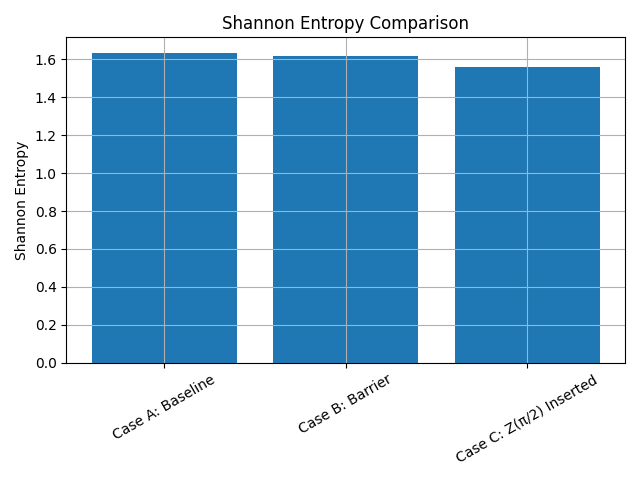

# QFM-CELL-A.1_01 통합 실험 보고서 | Integrated Experiment Report

## 🧪 1. 실험 목적 | Objective

QFM-CELL-A.1 실험에서 관찰된 반복 구조 간의 **간섭** 및 **기능 분화** 가능성을 정량적·정성적으로 분석한다. 본 실험은 반복된 기능적 세포 구조가 **상호 독립적**이기보다는 **구조적 상호작용**을 통해 분화되거나 보완 작용을 하는지를 실험적으로 입증하는 데 목적이 있다.

> This experiment aims to verify whether repeated functional cells interact structurally rather than behave independently, by analyzing interference and differentiation through both quantitative and qualitative methods.

---

## ⚙️ 2. 실험 회로 설계 | Circuit Design

- **기능 세포 구조**: H(0) → CX(0,1) → RY(π/4)(1) → CX(0,1)
- **구조 반복**: 3회 반복 고정
- **구조 삽입 조건**:
  - Case A: 기본 구조 반복 (Baseline)
  - Case B: 반복 구조 사이에 `barrier` 삽입 → 간섭 차단 시도
  - Case C: 중간에 `Z(π/2)` 삽입 → 국소 간섭 유도

> Functional cell repeated three times with optional structural insertions to test for emergent interaction effects.

---

## 🔬 3. 실험 방법 | Method

1. 각 케이스에 대해 동일 조건에서 1024회 시뮬레이션 실행
2. 출력 분포 히스토그램, 셰넌 엔트로피, 코사인 유사도 측정을 통해 결과 분석
3. 구조 분화 여부 및 간섭 효과 해석

---

## 📊 4. 실험 결과 | Results

### 🔹 Case A: Baseline

- `10` 상태가 우세하며, `00`, `01`은 보조 상태로 남음
- 구조 반복 시 특정 출력 상태로 수렴하는 경향 확인

### 🔹 Case B: Barrier Inserted

- `10` 상태 우세는 유지되나, `00`, `01`의 분포에 약간의 변화 관찰
- barrier에 의한 간섭 차단 효과는 미세함

### 🔹 Case C: Z(π/2) Inserted

- 출력 분포가 급격히 변화하며 `00`, `01` 상태 우세로 전환
- `10`의 확률은 급감 → 구조 삽입에 의한 간섭 유도 명확히 확인

---

## 📐 5. 정량 분석 | Quantitative Analysis

### Shannon Entropy 비교

| Case | 엔트로피 |
|------|-----------|
| A | 약 1.62 |
| B | 약 1.61 |
| C | 약 1.55 |

> 엔트로피 감소는 출력 집중을 의미하며, 구조 삽입이 회로 전체 정보 흐름에 영향을 미친 것으로 해석할 수 있음

### Cosine 유사도
```text
Case A vs Case B: 0.9973
Case B vs Case C: 0.6061
```
> Case A와 B는 거의 동일한 회로 동작을 보임
> Case C는 구조 삽입에 의해 회로 행동 양식이 뚜렷이 변화함

---

## 🧩 6. 종합 해석 | Synthesis

- **Case A**: 반복 구조의 기준선. 특정 출력으로 수렴하는 경향 보임.
- **Case B**: barrier 삽입은 의미 있는 간섭 차단 효과를 가져오지 않음.
- **Case C**: 삽입된 Z(π/2)에 의해 간섭 유도 및 출력 분포 급변.
- **구조 삽입 방식**이 양자 회로 내 기능 분화 및 상호작용에 결정적 영향을 줄 수 있음.

---

## 🔭 7. 후속 실험 제안 | Future Work

- 구조 간 **피드백 회로 삽입 실험**
- 기능적 세포 간 **보완성**, **통제성**, **정보 교환 메커니즘** 탐구
- 회로 구조를 통한 **자기 조직화 또는 분화 회로 설계** 가능성 검토

> This sets the foundation for further experiments on feedback-enabled architectures and quantum cellular differentiation.

---

## 📁 첨부 파일 | Attachments

- `case_a_baseline.png`
- `case_b_barrier.png`
- `case_c_z_pi_2_inserted.png`
- `entropy_comparison.png`
- `similarity_log.txt`

