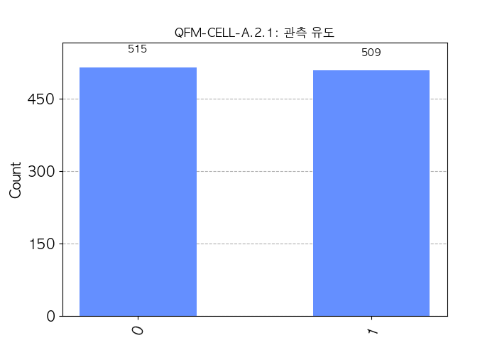
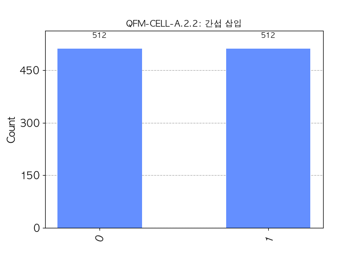
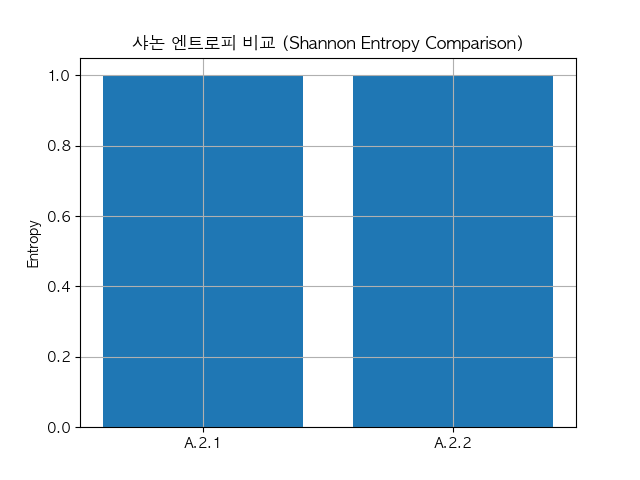

# QFM-CELL-A.2-NU: 조건 미사용 구조 반응 시험 | QFM-CELL-A.2-NU: Structural Responsiveness Without Condition

## 통합 실험 목적 | Objective

기능적 세포 단위 양자 회로에서 **외부 자극(관측 또는 간섭)**에 따라 구조적 반응이 유도될 수 있는지를, 조건 분기나 피드백 없이 평가한다. 본 실험은 구조적 반응 유도 가능성을 확인하기 위한 기준 실험이다.

This experiment evaluates whether a functional cell-level quantum circuit can exhibit a structural response to **simple external stimuli (measurement or interference)** without using conditional logic, feedback, or structural implantation.

---

## 실험 개요 | Experiment Overview

- 실험군 이름: QFM-CELL-A.2-NU (Non-Utilizing)
- 실험 유형: 조건, 피드백, 구조 삽입 없이 자극 기반 구조 반응 가능성 평가
- 회로 실행 수: 각 회로당 1024회
- 비교 기준: 측정이 없는 A.1 회로

- Group Name: QFM-CELL-A.2-NU (Non-Utilizing)
- Type: Evaluation of stimulus-based structural response without logic or feedback
- Execution Count: 1024 shots per circuit
- Control: Circuit without measurement (A.1)

---

## 회로 설계 | Circuit Designs

### 회로 A.2.1: 관측 유도 | A.2.1: Measurement-Induced

```python
qc = QuantumCircuit(2, 1)
qc.h(0)
qc.cx(0, 1)
qc.measure(0, 0)
```
- 목적 | Purpose: 단순한 관측이 구조 반응을 유도하는지 확인

### 회로 A.2.2: 간섭 삽입 | A.2.2: Interference-Injected

```python
qc = QuantumCircuit(2, 1)
qc.h(0)
qc.cx(0, 1)
qc.x(1)
qc.measure(0, 0)
```
- 목적 | Purpose: 간섭 연산이 구조 반응을 유도하는지 확인

---

## 실험 결과 및 분석 | Results and Analysis

### A.2.1: 관측 유도 | A.2.1: Measurement-Induced

- 측정 결과: `0` → 515, `1` → 509
- 샤논 엔트로피: 0.9999

### A.2.2: 간섭 삽입 | A.2.2: Interference-Injected

- 측정 결과: `0` → 512, `1` → 512
- 샤논 엔트로피: 1.0000

### 정량 지표 비교 | Quantitative Comparison

- Shannon Entropy:
  
- Cosine Similarity (A.2.1 vs A.2.2): ≈ 0.9999

### 해석 | Interpretation

- 두 회로 모두 출력 확률 분포는 거의 균등함 (약 50:50)
- 간섭 게이트 삽입 유무에 따른 통계적 차이는 미미함
- 정보 엔트로피 및 분포 유사도 기준으로, 두 회로는 동일한 반응 특성을 보임
- 단순한 관측 또는 간섭만으로는 구조적 반응이 유도되지 않음

---

## 비고 및 후속 계획 | Notes and Future Plans

- 단순 자극만으로는 구조 반응이 유의미하게 나타나지 않음이 확인됨
- 구조 반응 유도를 위해서는 **조건 분기, 피드백 구조, 또는 명시적 구조 삽입(Structural Implantation)**이 필요함을 시사함
- 후속 실험 A.2-CB에서는 조건 분기를 통한 구조 반응 유도 여부를 평가할 예정
- 상태 벡터 기반의 A.1 회로 해석 결과는 별도 문서로 정리 예정

