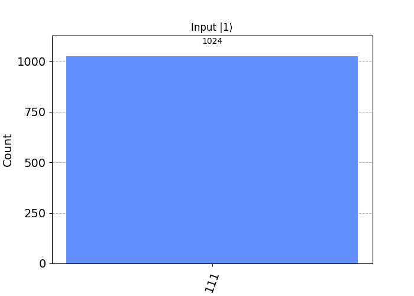
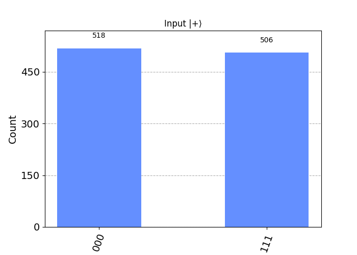
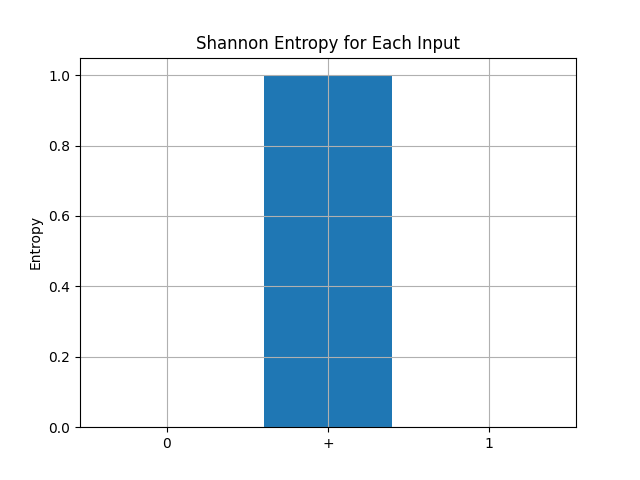

# QFM-CELL-A.2: 구조적 반응 유도 실험  
# QFM-CELL-A.2: Structural Response Induction Experiment

## 실험 목적  
## Objective  
구조적 반응 유도 구조 내에서 입력 조건에 따라 회로의 반응 경로가 분기되는지를 확인한다. 이를 통해 기능적 세포 구조가 구조 삽입 및 구조적 반응 유도 능력을 내포하고 있음을 검증한다.  
This experiment investigates whether the structural response induction framework exhibits branching behavior in response to conditional inputs, thereby verifying that the functional cell structure encompasses capabilities of structural insertion and response induction.

---

## 실험 회로 설계  
## Circuit Design  

- **회로 구성 / Circuit Composition**:  
  구조적 반응을 유도하는 회로는 다음과 같이 설계되었다.  
  The circuit inducing structural response is designed as follows:

  ```
  qreg q[3];
  creg c[3];

  h q[0];                // 상태 준비 (슈퍼포지션) / State preparation (superposition)
  cx q[0], q[1];         // 제어 기반 분기 구조 / Control-based branching structure
  ccx q[0], q[1], q[2];  // 조건적 분기 (q[0]=1 and q[1]=1일 때) / Conditional branching (if q[0]=1 and q[1]=1)
  measure q -> c;
  ```

- **구조적 분기 설명 / Description of Structural Branching**:  
  - `q[2]`의 상태는 `q[0]`과 `q[1]`이 모두 1일 때만 반전된다.  
  - This indicates structural response induction triggered under specific conditions.
  - 구조적으로 `q[2]`는 기능적 세포 내부의 조건적 출력 요소로 간주할 수 있다.  
  - Structurally, `q[2]` can be regarded as the conditional output element within the functional cell.

---

## 관측 지표  
## Observation Metrics

- `q[2]`의 측정값이 1이 되는 확률을 중심으로 관측한다.  
- Observation focuses on the probability of measuring `q[2]` as 1.
- 다양한 초기 `q[0]` 상태 분포를 통해 구조적 반응 유도 민감도를 측정한다.  
- Sensitivity of structural response induction is measured across different initial states of `q[0]`.

---

## 실험 반복 조건  
## Repetition Condition

- 1024번 반복 실행한다.  
- The circuit is executed 1024 times per condition.
- 입력 상태를 다음 세 가지로 설정하여 실험군을 수행한다:  
- Input conditions are set as follows:
  - `|0⟩`, `|+⟩`, `|1⟩`

---

## 기대 결과 및 해석  
## Expected Results and Interpretation

- `q[2]`의 출력 확률이 입력 조건에 따라 의미있게 달라지면, 기능적 세포 구조는 구조 삽입 및 구조적 반응 경로를 내포하고 있는 것으로 해석할 수 있다.  
- If the output probability of `q[2]` varies significantly depending on the input, it indicates that the functional cell structure embodies structural insertion and branching response pathways.
- 이 구조는 조건적 의사결정 회로 또는 분기형 유전자 회로로 확장될 수 있다.  
- This structure can be extended to conditional decision-making circuits or branching gene regulation models.

---

## 실험 결과 요약  
## Experiment Result Summary

### 입력 상태별 출력 분포  
### Output Distribution per Input State

| 입력 상태 (Input State) | 출력 결과 (Output Results) | 측정 비율 (Measurement Ratio) | 해석 (Interpretation) |
|:---|:---|:---|:---|
| `|0⟩` | `000`: 1024/1024 | 100% → `q[2]=0` 유지 | 조건 불충족 → 분기 없음 / Condition unmet → No branching |
| `|1⟩` | `111`: 1024/1024 | 100% → `q[2]=1` 반전 | 조건 충족 → 분기 발생 / Condition met → Branching occurs |
| `|+⟩` | `000`: 518<br>`111`: 506 | 약 50% 혼합 / ~50% mixture | 조건 일부 충족 → 양방향 분기 / Partially met → Bidirectional branching |

### 구조 해석  
### Structural Interpretation

- 회로는 `q[0]`과 `q[1]`이 모두 1일 때만 `q[2]`를 반전시키는 구조를 가진다.  
- The circuit flips `q[2]` only when both `q[0]` and `q[1]` are 1.
- `|+⟩` 입력은 중첩(superposition)으로 인해 양자적 분기 확률을 나타낸다.  
- The `|+⟩` input exhibits quantum branching probabilities due to superposition.
- 이 구조는 조건 기반 정보 전송 회로나 유전자 발현 제어 모델로 확장 가능하다.  
- This structure can be extended to conditional information transmission circuits or gene expression control models.

### 결과 이미지  
### Result Images

- `branching_input_0.png`:   
- `branching_input_1.png`:   
- `branching_input_+.png`:   
- `entropy_comparison.png`: 

---

## 비고  
## Notes

- 이 회로는 구조 삽입 및 구조적 반응 유도 능력을 입증하는 최소 구조로, 향후 내부 조건을 학습하거나 피드백 반응을 포함하는 확장형 회로의 기반이 된다.  
- This circuit proves minimal structural insertion and response induction capabilities, forming a basis for future circuits incorporating conditional learning or feedback responses.
- `q[2]`의 출력 상태는 후속 회로의 입력 조건으로 활용될 수 있으며, 이를 통해 회로 간 상태 의존적 연결이 가능함을 시사한다.  
- The output state of `q[2]` can serve as an input condition for subsequent circuits, suggesting the feasibility of state-dependent interconnections between circuits.
- 본 실험의 구조적 반응 유도 메커니즘은 단일 회로 내부 반응을 넘어, 양자 회로 간 논리적 트리거 체계 및 기능적 정보 전달 경로를 형성할 수 있는 기반이 된다.  
- Thus, the structural response induction mechanism demonstrated here lays the foundation for forming logical trigger systems and functional information transmission pathways across quantum circuits.

