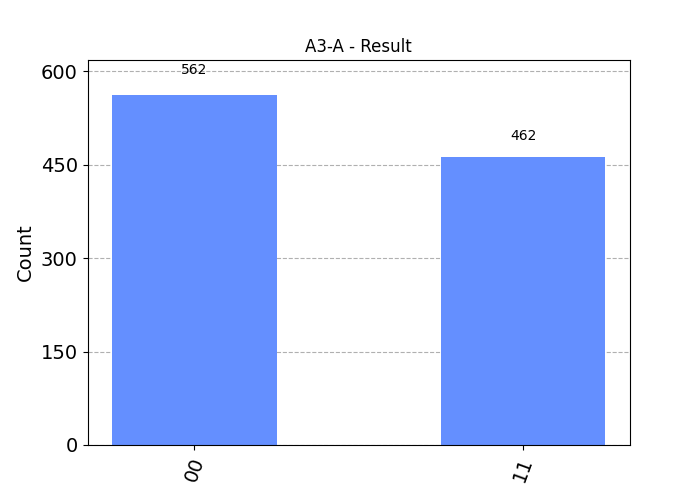
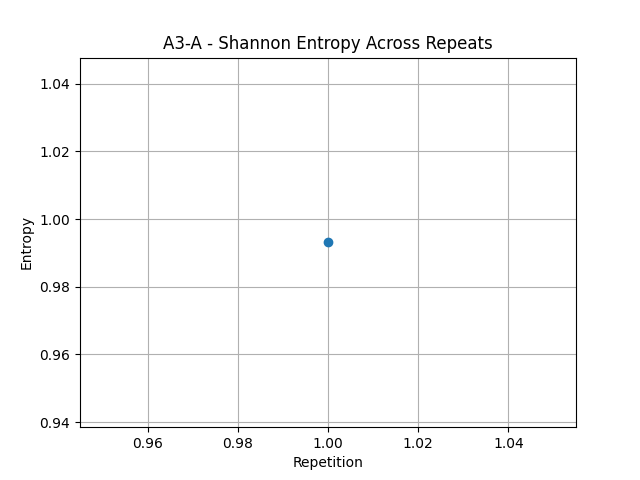

# QFM-CELL-A.3 – 분기 구조 반복 실험 | QFM-CELL-A.3 – Branch Structure Repetition Experiment

## 🧪 실험 개요 | Experiment Overview
- **실험명 | Experiment Name:** QFM-CELL-A.3 – 분기 구조 반복 실험 | QFM-CELL-A.3 – Branch Structure Repetition Experiment
- **실험 목적 | Objective:**
  - 동일한 분기 구조 회로를 반복적으로 실험했을 때, 결과 분포의 일관성 또는 구조적 적응을 관찰한다. | To observe the consistency of output distribution or structural adaptation when repeating the same branch structure circuit.
  - 반복 회로의 입력 조건과 관찰 조건이 상이함에도 불구하고 구조적 반응성이 발생하는지 확인한다. | To verify whether structural responsiveness occurs even when input and observation conditions differ.

## 🔩 회로 구조 개요 | Circuit Structure Overview
- **회로 구성 요소 | Circuit Components:**
  - 초기 상태 |0⟩ 또는 |+⟩ | Initial state |0⟩ or |+⟩
  - 분기 조건 회로 | Branch condition circuit (based on QFM-CELL-A.1)
  - 관찰 기준 회로 삽입 | Measurement basis circuit insertion
  - 전체 구조를 동일하게 구성한 후 3회 반복 실행 | Repeat the entire structure three times

- **회로 모티프 예시 | Example Motif:**
  ```
  ──H──■──┐   ── Repeat ──
       │    │
      ─X───MZ
  ```

- **관찰 위치 | Measurement Position:**
  - 분기 직후 또는 전체 반복 종료 후 | After each branch or after total repetition

## 🧬 실험군 구성 | Experimental Groups
| 실험군 | 초기 상태 | 분기 조건 | 반복 횟수 | 관찰 방식 |
|--------|------------|------------|--------------|-------------|
| A3-A   | |0⟩        | 고정 조건 | 3회          | 모든 반복 후 단일 측정 | After all repetitions, single measurement |
| A3-B   | |+⟩        | 고정 조건 | 3회          | 반복별 개별 측정 | Measurement at each repetition |
| A3-C   | |0⟩        | 랜덤 조건 | 3회          | 최종 분기만 측정 | Measurement only at final branch |
| A3-D   | |+⟩        | 랜덤 조건 | 3회          | 반복 전체 평균화 측정 | Averaged measurement over all repetitions |

## 🎯 기대 효과 | Expected Outcomes
- 분기 구조가 회로 내 반복될 경우, 그 효과가 누적되는지 또는 독립적으로 작동하는지 확인한다. | Confirm whether the effect accumulates or operates independently when the branch structure is repeated in the circuit.
- 랜덤 조건 하의 구조 반응성 유도 여부를 통해 구조-의도 간 상관관계 추가 실험 기반을 확보한다. | Secure additional experimental basis for structure-intent correlation through structural responsiveness under random conditions.
- 관찰 위치와 반복 형태 변화에 따른 구조의 반응성 통계적 유의성을 검증한다. | Verify the statistical significance of structural responsiveness according to observation position and repetition type.

## 📊 결과 분석 지표 | Analysis Metrics
- 히스토그램 분포 변화 (반복별 또는 최종) | Change in histogram distribution (per repetition or final)
- 실험군 간 평균값 비교 | Comparison of average values between experimental groups
- 반복 회수에 따른 구조적 편향 발생 여부 | Detection of structural bias according to the number of repetitions

## 🖼️ 실험 결과 (A3-A) | Experimental Results (A3-A)
- 실험군 A3-A는 고정된 분기 조건 하에 초기 상태 |0⟩로 설정된 회로를 3회 반복 실행한 뒤, 마지막 반복 후 전체 회로를 단일 측정하였다. | Group A3-A executed the circuit set with initial state |0⟩ three times under fixed branch conditions and performed a single measurement after the final repetition.

**최종 반복 실험 결과 | Final Repetition Result:**

- 상태 `00`: 562회, 상태 `11`: 462회 | State `00`: 562 counts, State `11`: 462 counts

**Shannon 엔트로피 분석 | Shannon Entropy Analysis:**

- 계산 결과: 0.994 | Calculated value: 0.994

### 해석 | Interpretation
- `00`과 `11` 상태의 비율이 매우 근접하여 분포가 대칭적이다. | The ratio between `00` and `11` states is very close, indicating a symmetrical distribution.
- 구조 반복이 결과의 일관성을 유도함을 나타낸다. | Shows that the structural repetition induces output consistency.
- 엔트로피가 거의 최대치(1)에 가까워, 출력 결과의 불확실성이 매우 높다. | The entropy being near the maximum value (1) suggests very high uncertainty in output distribution.
- 결과 분포는 고정된 구조가 무작위성을 충분히 보존함을 시사한다. | The distribution suggests that the fixed structure sufficiently preserves randomness.

## 📁 후속 작업 | Future Work
- 나머지 실험군 (A3-B, A3-C, A3-D) 실행 및 결과 비교 분석 | Perform experiments and comparative analysis for the remaining groups (A3-B, A3-C, A3-D)
- 반복 조건에 따른 구조 반응성의 누적 또는 적응 여부 심층 분석 | In-depth analysis of accumulation or adaptation of structural responsiveness according to repetition conditions
- 실험군 간 시각적 비교 리포트 작성 | Create a visual comparative report between experimental groups

